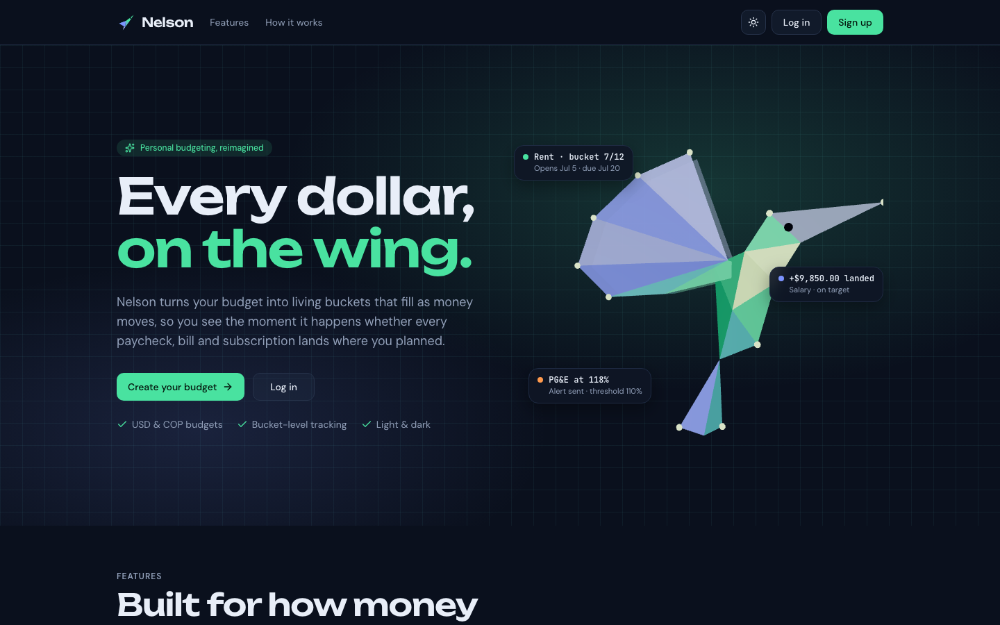
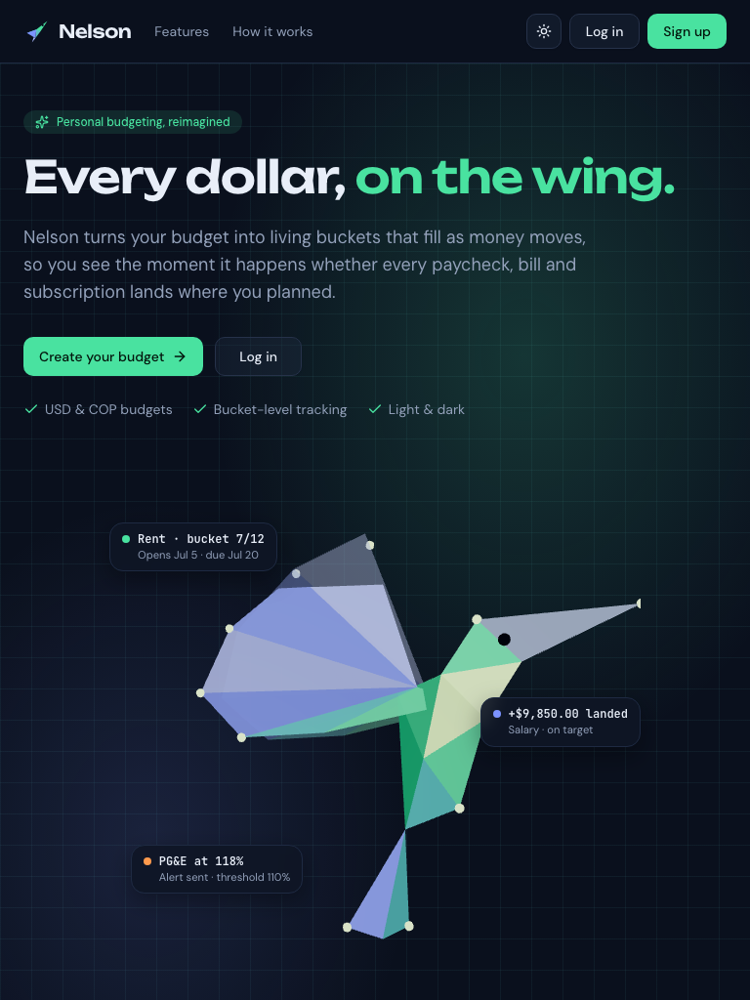
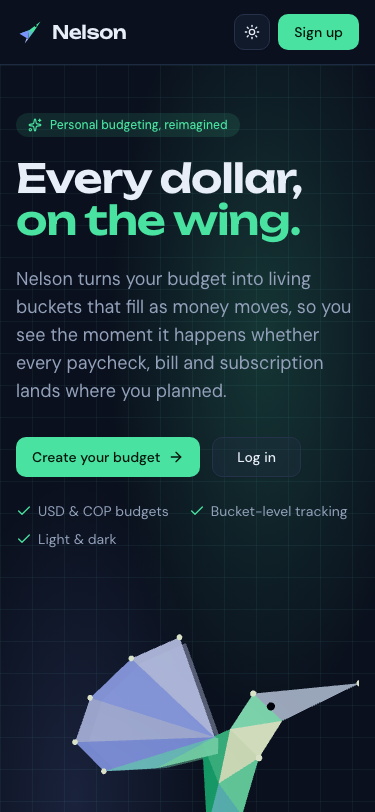
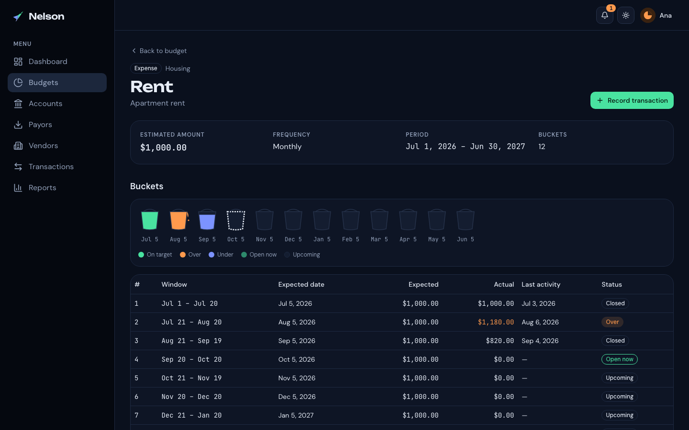
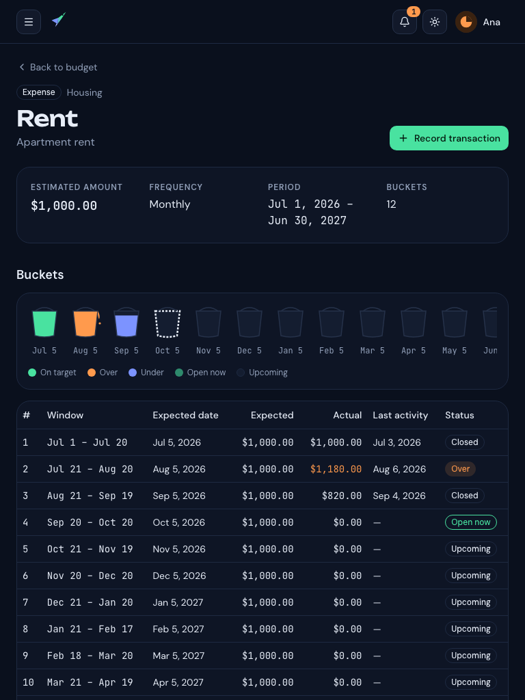
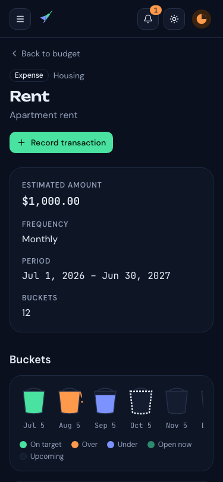

# Nelson

A personal budget web app that turns every planned paycheck and bill into a row of **buckets**
that fill as money moves — so you see, the moment it happens, whether each payment landed where
you planned.


> API: [fsdev-nelson-backend](https://github.com/gusanchefullstack/fsdev-nelson-backend)

## Table of Contents

- [Screenshots](#screenshots)
- [Why Nelson?](#why-nelson)
- [Features](#features)
- [Installation](#installation)
- [Quick Start](#quick-start)
- [Configuration](#configuration)
- [Design tokens](#design-tokens)
- [Project Structure](#project-structure)
- [Tests](#tests)
- [Deployment](#deployment)
- [What I learned](#what-i-learned)
- [Roadmap](#roadmap)
- [Contributing](#contributing)
- [License](#license)
- [Credits](#credits)
- [Author](#author)

## Screenshots

**Landing** — 1440 px, 768 px and 375 px


 

**Bucket map** — 1440 px, 768 px and 375 px


 

## Why Nelson?

Monthly totals hide timing: a late paycheck or a doubled subscription vanishes in the sum. Nelson
keeps each expected payment in its own window, shows each one as a bucket that fills, overflows
or waits, and tells you when something drifts beyond the tolerance you choose.

## Features

- **Budgets three ways** — Lite (basics first), Guided (step by step) or Complete (one tree screen).
- **Bucket map** — bucket-shaped gauges for every expected payment: on target, over, under, open, upcoming.
- **Transactions** — income goes payor → account, expenses account → vendor; balances update instantly.
- **Dashboard** — net cash flow, expected vs actual to date, recent activity, balances and alerts.
- **Reports** — forecast vs actual by month, top N, end-of-period projection and suggestions.
- **Alerts** — in-app notifications when spending runs over or income falls short.
- **Hummingbird landing** — a low-poly 3D hummingbird (three.js) with a static fallback for reduced motion.
- **Light & dark themes**, US-English formatting, fully keyboard accessible, tested at 375/768/1440 px.

## Installation

**Prerequisites:** Node.js ≥ 24, npm, and the [API](https://github.com/gusanchefullstack/fsdev-nelson-backend)
running locally (by default on port 3000).

```bash
git clone git@github.com:gusanchefullstack/fsdev-nelson-frontend.git
cd fsdev-nelson-frontend
npm install
cp .env.example .env
npm run dev                 # http://localhost:5173 — /api is proxied to the backend
```

## Quick Start

1. Open http://localhost:5173 and choose **Sign up**.
2. Complete your profile (time zone, phone with country flag, avatar).
3. **Budgets → New budget → Guided**, add a "Salaries" income item and a monthly "Rent" expense.
4. Add an account, a payor and a vendor, then **Record transaction** — watch the Rent bucket fill on
   the item page and the dashboard update.

## Configuration

| Variable | Description | Required | Default |
|----------|-------------|----------|---------|
| `VITE_API_PROXY_TARGET` | Backend URL for the dev-server `/api` proxy | No | `http://localhost:3000` |

In production there are no build-time variables: `vercel.json` rewrites `/api/*` to the backend,
keeping cookies first-party.

## Design tokens

Every color, font, size, radius, shadow and gradient lives in
[`src/styles/tokens.css`](src/styles/tokens.css), with light and dark sets taken from the design
drafts. Tailwind utilities (`bg-primary`, `text-muted-foreground`, `fill-bucket-over`, …) map to
these tokens, so restyling the app means editing one file. Fonts: DM Sans (text), Unbounded
(display) and JetBrains Mono (numbers), self-hosted with Fontsource.

## Project Structure

```text
src/
├── routes/            # TanStack Router file routes (_app = signed-in layout)
├── features/          # Feature modules: budgets, transactions, sources, reports, alerts, landing…
├── components/        # Shared UI; ui/ = shadcn components; viz/ = bucket gauge and charts
├── lib/               # API client + generated types, guards, formatting, validation
├── stores/            # Zustand theme store
└── styles/            # tokens.css + Tailwind entry
tests/
├── unit/              # Vitest + Testing Library
└── e2e/               # Playwright at 375/768/1440 px, axe accessibility audits
```

## Tests

```bash
npm test                    # Vitest unit/component tests
npm run test:e2e            # Playwright: user stories, accessibility (axe) and error handling
npm run lint && npm run typecheck
npm run gen:api             # regenerate API types from ../fsdev-nelson-backend/docs/openapi.yaml
```

The E2E suite starts both the frontend and the backend (against the Neon `development` branch).

## Deployment

Deployed to **Vercel** as a static SPA. Set the backend URL in [`vercel.json`](vercel.json)
(`<BACKEND_URL>` placeholder) before the first deploy.

## What I learned

- **Same-origin auth beats CORS.** Rewriting `/api/*` through the frontend keeps the session cookie
  first-party and avoids third-party cookie blocking.
- **React reuses DOM nodes.** A "Next" button that turned into "Create budget" submitted the form
  on the same click — distinct `key`s fixed it.
- **react-hook-form only tracks what you read.** `isDirty` must be read during render for a
  navigation blocker to see it.
- **Accessible charts.** Every chart has an equivalent data table; wide scroll areas must be
  keyboard-focusable (`scrollable-region-focusable`), and Recharts' accessibility layer adds
  `tabindex` that conflicts with `aria-hidden` wrappers.
- **One model, two renderers.** The hummingbird geometry drives both the three.js scene and the
  SVG fallback used for `prefers-reduced-motion`.
- References: [TanStack Router](https://tanstack.com/router) ·
  [TanStack Query](https://tanstack.com/query) · [Tailwind v4 theme variables](https://tailwindcss.com/docs/theme) ·
  [React Three Fiber](https://r3f.docs.pmnd.rs) · [axe-core rules](https://dequeuniversity.com/rules/axe/)

## Roadmap

- [x] Budgets (Lite, Guided, Complete), buckets and transactions
- [x] Dashboard, reports and alerts
- [x] Light/dark themes and WCAG 2.2 AA
- [ ] Receipt capture with AI
- [ ] Bank sync (Plaid)
- [ ] Smart Advisor
- [ ] Spanish translation
- [ ] Mobile apps

## Contributing

1. Fork and branch: `feat/short-description` or `fix/short-description`.
2. Use [Conventional Commits](https://www.conventionalcommits.org/).
3. Keep visual values in `tokens.css`; run `npm run lint && npm run typecheck && npm test && npm run test:e2e`.
4. Open a pull request.

## License

Distributed under the MIT License. See [LICENSE](LICENSE).

## Credits

[React](https://react.dev), [Vite](https://vite.dev), [TanStack](https://tanstack.com),
[shadcn/ui](https://ui.shadcn.com) and [Radix](https://www.radix-ui.com),
[Tailwind CSS](https://tailwindcss.com), [Recharts](https://recharts.org),
[three.js](https://threejs.org) / [React Three Fiber](https://r3f.docs.pmnd.rs),
[react-phone-number-input](https://gitlab.com/catamphetamine/react-phone-number-input),
[Playwright](https://playwright.dev) and [axe-core](https://github.com/dequelabs/axe-core).

## Author

**Gustavo Sanchez Galarza**

[](https://www.linkedin.com/in/gustavosanchezgalarza/)
[](https://github.com/gusanchefullstack)
[](https://hashnode.com/@gusanchedev)
[](https://x.com/gusanchedev)
[](https://bsky.app/profile/gusanchedev.bsky.social)
[](https://www.freecodecamp.org/gusanchedev)
[](https://www.frontendmentor.io/profile/gusanchefullstack)
